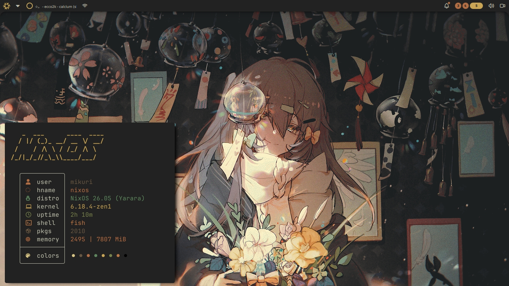
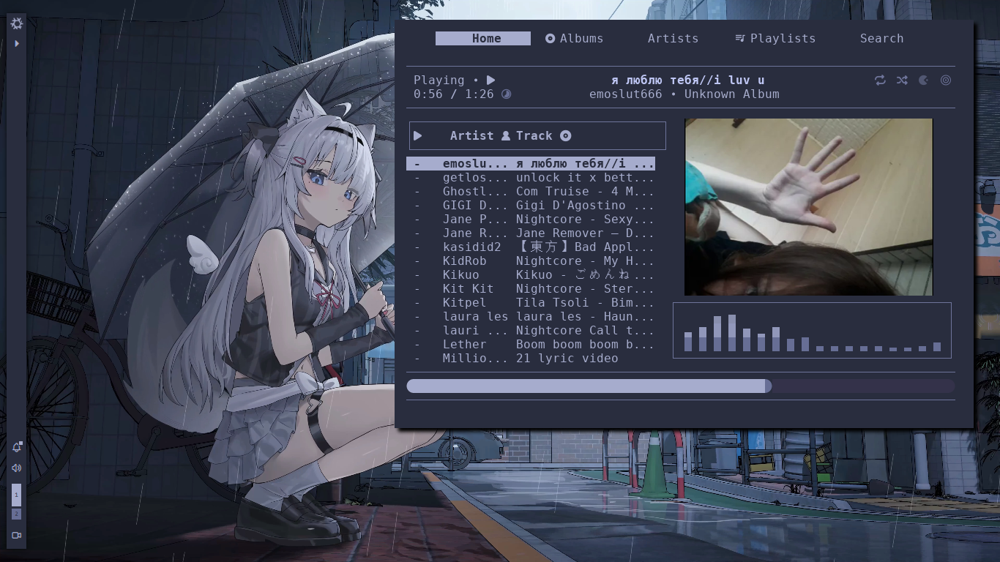
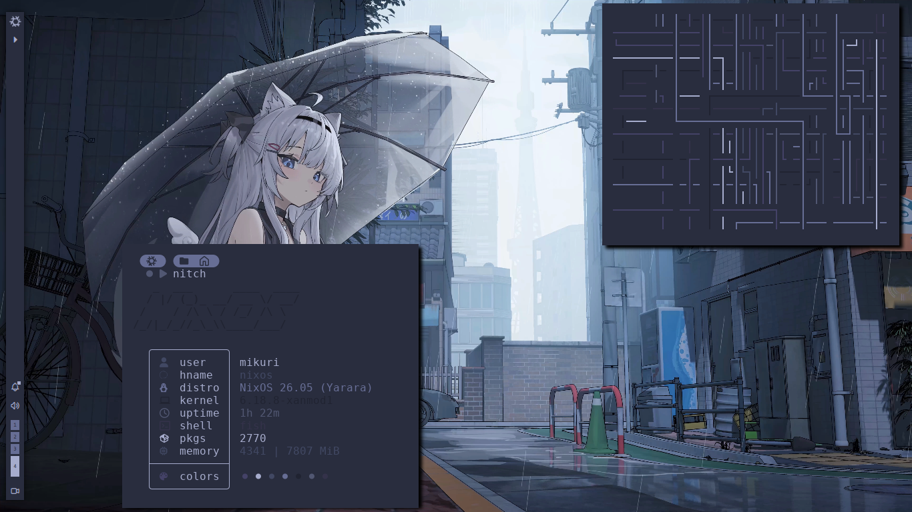
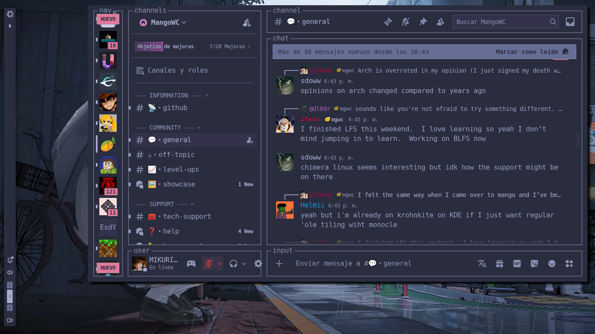

# my-nixos-config
my messy nixos configurations

If you are using Nixos and Noctalia but the GTK colors are not changing, run this command.
```
sudo chmod u+rw ~/.local -R
sudo chmod u+rw ~/.config -R
```

- [noctalia-shell](https://github.com/noctalia-dev/noctalia-shell)

# preview 




